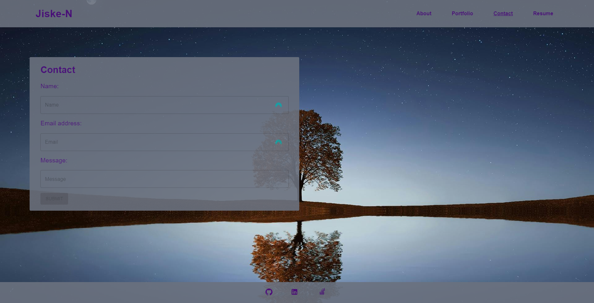

# React Portfolio

## The Project

This project was designed as a place to be able to share my projects both when applying for jobs and with fellow developers for collaboration on future projects. Other features include:

-   The ability to download a Resume.
-   Fully mobile responsive.
-   Easy customisation.

## Link & Contents

-   [The Deployed Page](https://jiske-portfolio.netlify.app)
-   [Installation](#installation)
-   [Usage](#usage)
-   [Future Development](#future-development)
-   [Credits](#credits)
-   [Questions and Feedback](#questions-and-feedback)
-   [License](#license)

## Image

## Installation

This site is live on the web so no installation is necessary.

## Usage

Just click the following [link](https://jiske-portfolio.netlify.app), and have a look around!

## Future Development

Ideas for future development include:

-   Building a backend.
-   Additional features such as the ability to leave comments.
-   Adding additional projects.

## Credits

Project requirements provided by edX/Monash University.

Project set by edX/Monash University. Made use of the Xpert learning assistant, AskBcs and our instructor with troubleshooting issues.

GitHub for hosting the repository.

[pixabay](https://pixabay.com) for the home background.

Netlify for hosting the deployed page.

## Questions and Feedback

If you find any issues or have contributions or feedback you can do so by opening an [issue](https://github.com/Jiske-N/webAppPortfolio/issues) on Github.

## License

None
